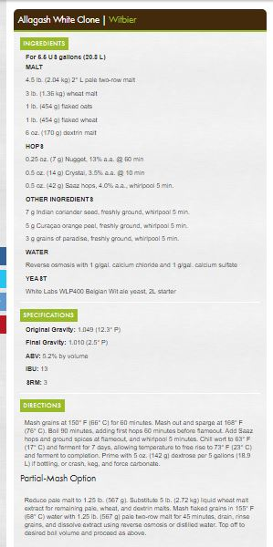
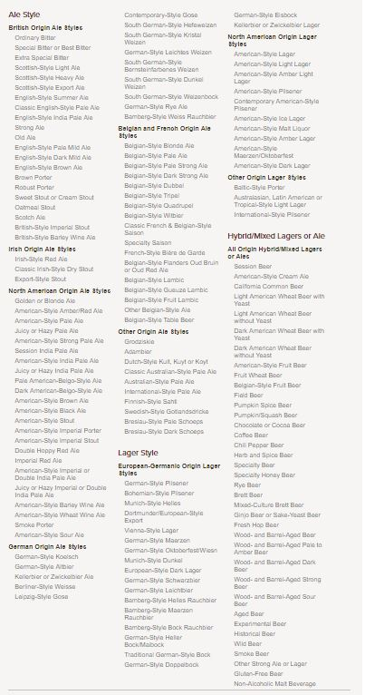

# Homebrew Beer Recipe Recommender

I wanted to develop a recommender that could read homebrew recipes from a database and recommend recipes similar to a recipe of interest.

## Data

I downloaded about 1000 recipes from American Homebrewers Association website. I used an HTML parser to extract the ingredients, instructions, specifications of the recipe.

An example recipe.

## Factors influencing flavor in beer
 
The base malt is the main ingredient in beer, very similar role to bread in a sandwhich. All other ingreients are supportive and should not overwelm the base malt. A base malt is usually 80% to 90% of the grain bill with specialtiy malts contributing up to 10% and other base malts if used should only contribute about 5%. Yeast also has a large impact on flavor. For example a beer with just a wheat base malt can used to create a wheat beer or a hezewienzen beer based on the yeast used. Yeast adds flavors and aromas. Hops add bitterness to the beer. 

Brewers Association beer style guidelines

## EDA

Top 20 beer styles in the database: 

    Style                                  Recipes

    American IPA                              58 
    Specialty Beer                            54 
    Spice/Herb/Vegetable Beer                 38
    American Pale Ale                         31
    Fruit Beer                                30 
    Saison                                    25 
    Belgian and French Ale                    19 
    Russian Imperial Stout                    19 
    English Brown Ale                         18 
    Belgian Specialty Ale                     18 
    American Barleywine                       18 
    Imperial IPA                              18 
    American Ale                              17 
    Sour Ale                                  14 
    Bock                                      13 
    Weizen/Weissbier                          13 
    Light Lager                               13 
    German Wheat and Rye Beer                 12 
    Amber Hybrid Beer                         12 
    Schwarzbier                               11 

There is no missing data:  

RangeIndex: 897 entries  
Data columns (total 2 columns):  
recipe      897 non-null object  
keywords    897 non-null object  
