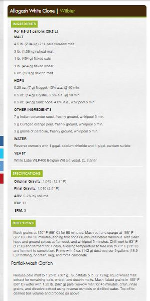
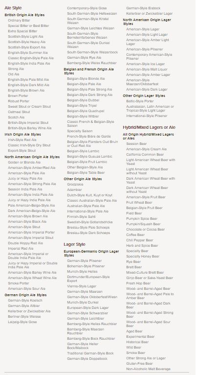

# Homebrew Beer Recipe Recommender

I wanted to develop a recommender that could read homebrew recipes from a database and recommend recipes similar to a recipe of interest.

## Data

I downloaded about 1000 recipes from American Homebrewers Association website. I used Beautiful Soup to extract the ingredients, instructions, specifications of the recipe then loaded the data into a Mongo database. I used 897 recipes in the model. Some of the recipes that are in the database are for cider and mead. They were excluded from this model.

An example recipe.

## Factors influencing flavor in beer
 
The base malt is the main ingredient in beer. All other ingredients are supportive and should not overwhelm the base malt. Base malt is usually 80% to 90% of the grain bill with specialty malts contributing up to 10% and other base malts if used should only contribute about 5%. Yeast also has a large impact on flavor. For example, a beer with just a wheat base malt can be used to create a wheat beer or a hefeweizen beer based on the yeast used. Yeast adds flavors and aromas. Hops add bitterness to the beer. 

Brewers Association beer style guidelines

## EDA

Top 20 beer styles in the database: 

    Style                                  Recipes

    American IPA                              58 
    Specialty Beer                            54 
    Spice/Herb/Vegetable Beer                 38
    American Pale Ale                         31
    Fruit Beer                                30 
    Saison                                    25 
    Belgian and French Ale                    19 
    Russian Imperial Stout                    19 
    English Brown Ale                         18 
    Belgian Specialty Ale                     18 
    American Barleywine                       18 
    Imperial IPA                              18 
    American Ale                              17 
    Sour Ale                                  14 
    Bock                                      13 
    Weizen/Weissbier                          13 
    Light Lager                               13 
    German Wheat and Rye Beer                 12 
    Amber Hybrid Beer                         12 
    Schwarzbier                               11 

There is no missing data:  

RangeIndex: 897 entries  
Data columns (total 2 columns):  
recipe      897 non-null object  
keywords    897 non-null object  

## Models

The first approach was to use all of the ingredients extracted from the web pages. The model uses TF-IDF and the features are malts, hops, yeast, and other ingredients(spices, fruits, vegetables, etc.). The accuracy of the model was not as good as it could be. The reason for this is the way in which the ingredients were entered in the recipe. There wasn't a standard followed so base malts could be listed in the recipe in different formats. For example, Briess two-row malt, U.S. Two-Row, Pale two-row malt are the same malt, they are American 2-row pale.

Here are the recommendations for recipe's similar to Trigo Oscuro which is a Dunkelweizen using the recipe's ingredients. 

    Recipe                                       Style                                Beer Characteristics

    Weizenbock                                   Weizenbock                           A strong, malty, fruity, wheat-based ale combining the best flavors of a dunkelweizen and the rich strength and body of a bock.
    Hoppiness is an IPA                          India Pale Ale                       A hoppy, moderately-strong, very well-attenuated pale British ale with a dry finish and a hoppy aroma and flavor.   
    Roger That Roggenbier                        Roggenbier                           A dunkelweizen made with rye rather than wheat, but with a greater body and light finishing hops.
    Trick or Treat Bock                          German Wheat and Rye Beer            A dark, strong, malty lager beer.

    Dunkelweizen characteristics: A moderately dark, spicy, fruity, malty, refreshing wheat-based ale. 

The next approach was to standardize on the names used to describe the ingredients in the recipe. The model uses TF-IDF and features are malts, hops, yeast, and other ingredients(spices, fruits, vegetables, etc.).     
 Here is an example of some of the  standardized malt names:  
    
    amber   
    aromatic  
    belgian Pilsner   
    belgian Special-B  
    biscuit   
    black Barley  
    black   
    black Patent  
    british, 2 Row  
    brown   
    cara Amber  
    cara Hell  
    cara Red  
    caraMunich   
    caraStan  
    caraVienne   
    carafa Special  
    caramel 10  
    caramel 120  
    caramel 40  
    caramel 60  

Here are the recommendations for recipe's similar to Trigo Oscuro which is a Dunkelweizen using the recipe's standardized ingredients:  
  

    Recipe                                       Style                              Beer Characteristics
                                                                                    
    Weizenbock                                   Weizenbock                         A strong, malty, fruity, wheat-based ale combining the best flavors of a dunkelweizen and the rich strength and body of a bock.
    Holier than Meow Hefeweizen                  Weizen/Weissbier                   A pale, spicy, fruity, refreshing wheat-based ale.
    Kevin’s Mom                                  Weizen/Weissbier                   A pale, spicy, fruity, refreshing wheat-based ale.

    Dunkelweizen characteristics: A moderately dark, spicy, fruity, malty, refreshing wheat-based ale. 

Here are the recommendations for recipe's similar to Allagash White which is a Witbier using the recipe's standardized ingredients:  

    Recipe                                       Style                              Beer Characteristics

    Dollar to Döllnitz Gose                      Gose                               A highly-carbonated, tart and fruity wheat ale with a restrained coriander and salt character and low bitterness. Very refreshing, with bright flavors and high attenuation.
    Polka Dot Pilsner                            German Pilsner                     Crisp, clean, refreshing beer that prominently features noble German hop bitterness accentuated by sulfates in the water                    
    “Resurrection” Historical Grodziskie         Specialty Beer                     A low-gravity, highly-carbonated, light-bodied ale combining an oak-smoked flavor with a clean hop bitterness. Highly sessionable. 
    Paul and Nick’s Saison                       Saison                             A pale, refreshing, highly-attenuated, moderately-bitter, moderate-strength Belgian ale with a very dry finish

    Witbier charateristics: A refreshing, elegant, tasty, moderate-strength wheat-based ale.               

## Next Steps

The model is better but needs improvement. The standardization of all ingredients is still a work in progress. Once completed the model's accuracy should increase. If accuracy is improved, I would like to investigate using all malts and putting weights on the base malts in the recipe to reflect the influence they have on the flavor of the beer. 